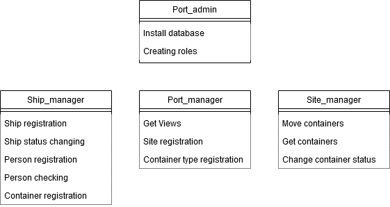
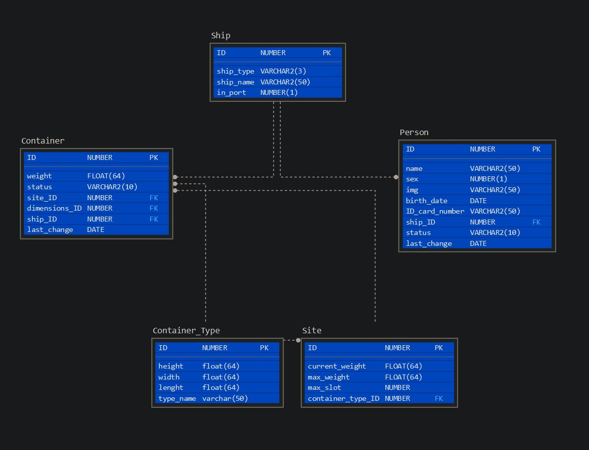
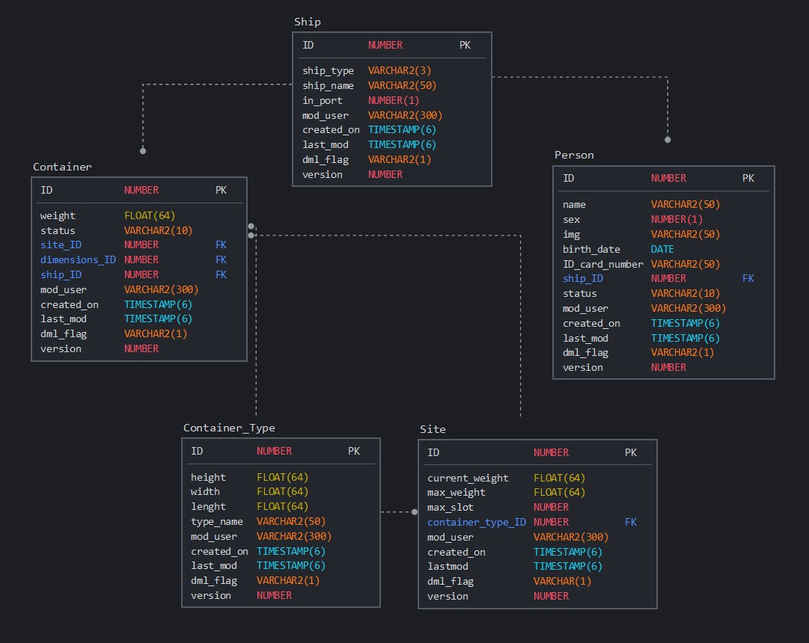

# ShipPortProject

Oracle DB - Assignment Project

The task of this small project to create a record of a Port.

## Installing

1. Login with sys
2. Run installer_sys.sql
3. Login with port_admin (Default password: portadmin)
4. Run installer_port_admin.sql
5. Login with sys
6. Run installer_sys_finish.sql
7. Done

## Roles

## Users

- Port_admin **Default password: portadmin**
- Port_manager **Default password: portmanager**
- Ship_manager **Default password: shipmanager**
- Site_manager **Default password: sitemanager**

## Diagram views

## Basic procedures

- Register ship
- Record ship state (In or out)
- On cruise ships types
  - Get person
  - Get leaving people
  - Get incoming people
- On carrier ships
  - Register container
  - Container type, weight registration
  - Site picking for container
  - Container status (In tranit, In registration phase, On site)
- Site management
  - Get free space
  - Register container
  - Move container
  - Sign off container
